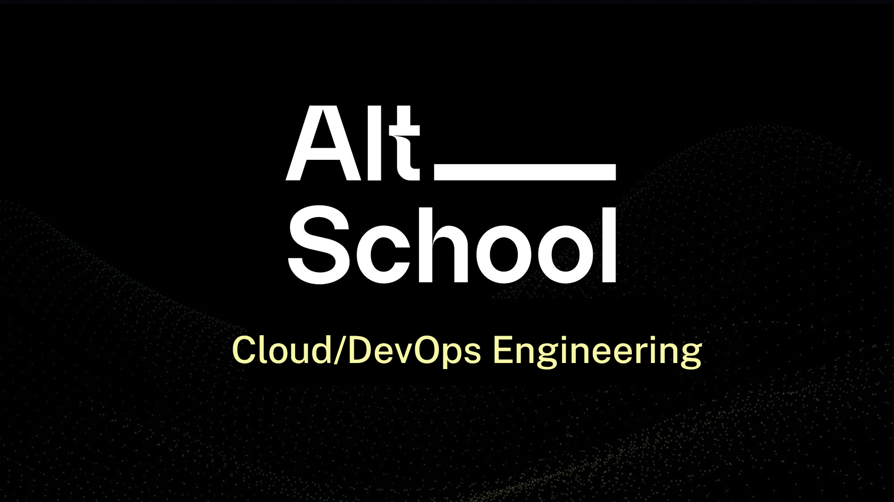

  

  
  
   
  
  
  

## Introduction

Documetations of Altschool Cloud track problems, updated daily. Please give me a [star](https://github.com/iJ03l/Altschool-Cloud-Playbook) 🌟 if you like it.

## Sites

-   Parent: https://altschoolafrica.com

## Topics ~So far~

-   Introduction To Linux Operating System
-   Linux Deep Dive
-   Version Control (Git)
-   SystemD
-   Bash Scripting
-   Configuration Management – Ansible
-   How the Internet Works

## Contributions

I'm looking for contributors/partners that understands a particular topic to the core to this repo! Send me [PRs](https://github.com/iJ03l/Altschool-Cloud-Playbook/pulls) if you're interested! See the following:

1. Fork [this repository](https://github.com/iJ03l/Altschool-Cloud-Playbook) to your own GitHub account and then clone it to your local machine.
1. Checkout a new branch.
1. Create a dedicated Folder.
1. Make some changes to your repository, then push the changes to your remote GitHub repository.
1. Create a pull request with your changes!
1. See [CONTRIBUTING](https://github.com/iJ03l/Altschool-Cloud-Playbook/blob/master/CONTRIBUTING.md) or [GitHub Help](https://help.github.com/en) for more details.

You can also contribute to [iJ03l/Altschool-Cloud-Playbook](https://github.com/iJ03l/Altschool-Cloud-Playbook) using [Gitpod.io](https://www.gitpod.io), a free online dev environment with a single click.

<!-- ## Stargazers over time

 -->

## Our Top Contributors

This project exists thanks to all the people who contribute.

## License

This work is licensed under a <a rel="license" href="http://creativecommons.org/licenses/by-sa/4.0/">Creative Commons Attribution-ShareAlike 4.0 International License</a>.
